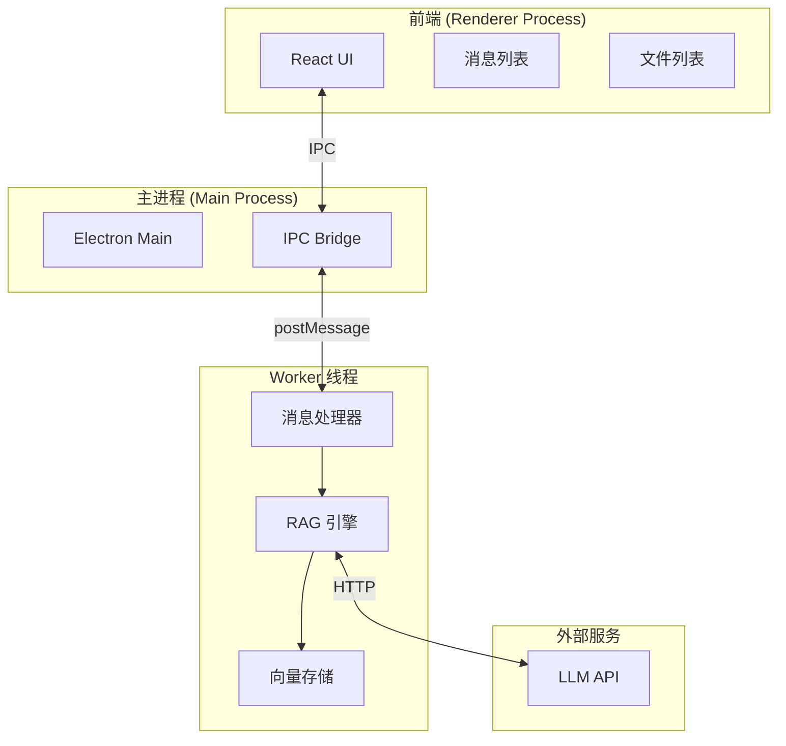
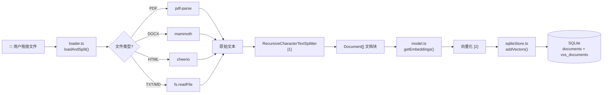
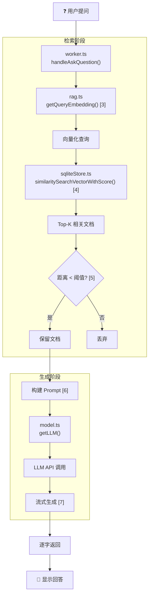
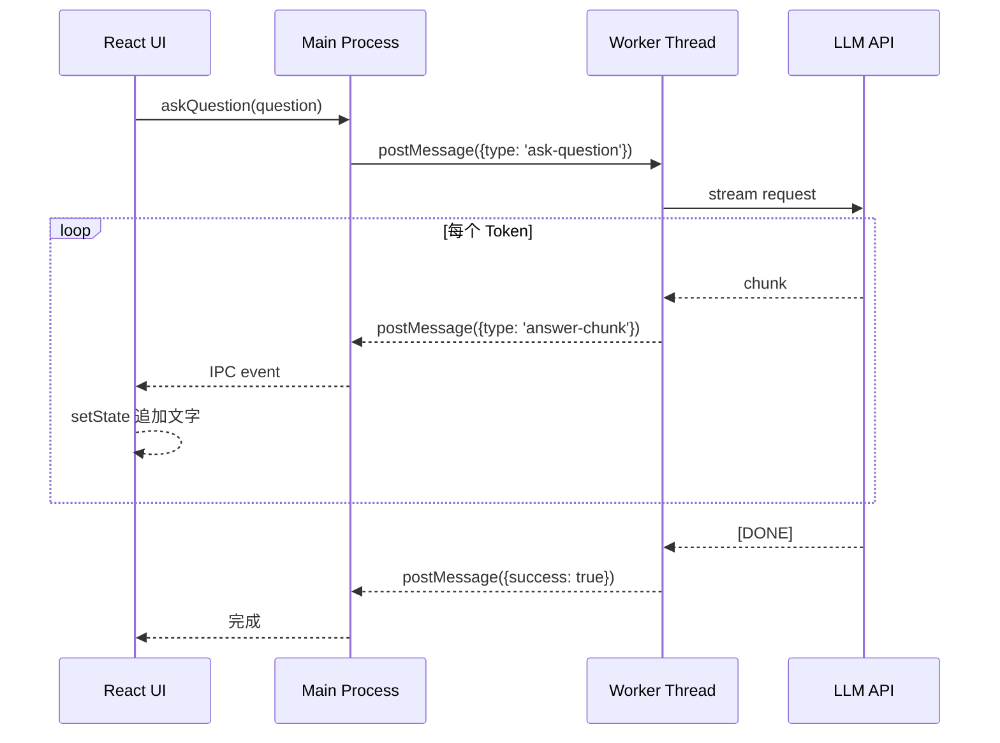
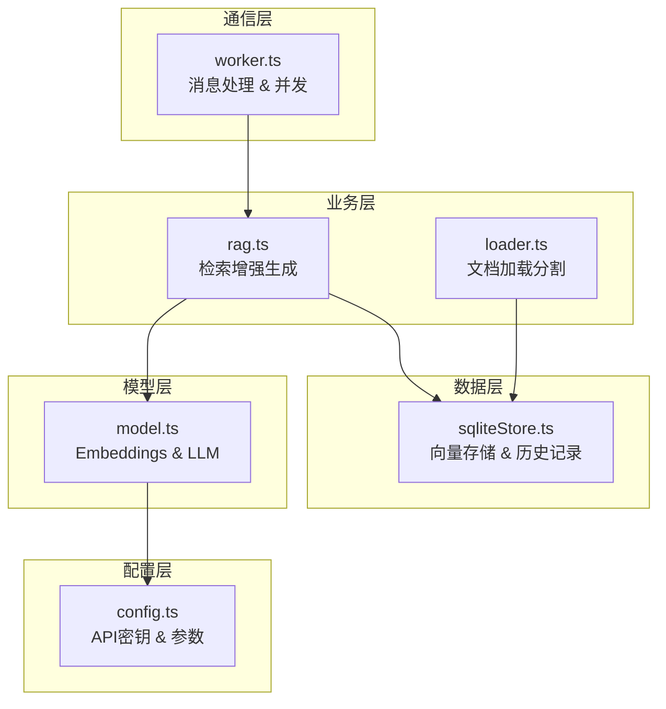

# 项目整体架构流程

本文档展示 RAG 知识库项目的完整数据流和关键流程。

## 系统架构总览

---

## 文档导入流程

用户拖放文件到应用后，文档如何被索引。

### 索引说明

| 索引 | 说明 |
|-----|-----|
| **[1] RecursiveCharacterTextSplitter** | 递归分割器，优先按段落、句子分割，保持语义完整。配置 `chunkSize=500, chunkOverlap=100` |
| **[2] 向量化** | 使用本地 `all-MiniLM-L6-v2` 模型，将文本转为 384 维向量 |

---

## 问答查询流程

用户提问后，系统如何检索并生成回答。

### 索引说明

| 索引 | 说明 |
|-----|-----|
| **[3] getQueryEmbedding()** | 带 LRU 缓存的 Embedding，相同问题直接返回缓存向量 |
| **[4] similaritySearchVectorWithScore()** | 使用 sqlite-vss 的向量搜索，返回 `[Document, distance][]` |
| **[5] 距离阈值** | `similarityThreshold=0.8`，距离越小越相似，超过阈值的结果被过滤 |
| **[6] Prompt 模板** | 包含系统提示、上下文、对话历史、当前问题 |
| **[7] 流式生成** | 使用 AsyncGenerator，通过 `yield` 逐块返回，前端实时渲染 |

---

## 流式通信流程

从 LLM 到用户界面的流式数据传递。

---

## 核心文件职责

---

## 关键配置参数

| 参数 | 位置 | 值 | 作用 |
|-----|-----|---|-----|
| `chunkSize` | loader.ts | 500 | 文档块大小 |
| `chunkOverlap` | loader.ts | 100 | 块重叠字符数 |
| `retrievalK` | config.ts | 3 | 检索 Top-K 数量 |
| `similarityThreshold` | config.ts | 0.8 | 相似度过滤阈值 |
| `historyLimit` | config.ts | 5 | 对话历史保留轮数 |
| `temperature` | config.ts | 0.7 | LLM 随机性 |
