# 项目整体架构流程

本文档展示 RAG 知识库项目的完整数据流和关键流程。

## 系统架构总览

```mermaid
flowchart TB
    subgraph Frontend ["前端 (Renderer Process)"]
        A[React UI]
        B[消息列表]
        C[文件列表]
    end

    subgraph Main ["主进程 (Main Process)"]
        D[Electron Main]
        E[IPC Bridge]
    end

    subgraph Worker ["Worker 线程"]
        F[消息处理器]
        G[RAG 引擎]
        H[向量存储]
    end

    subgraph External ["外部服务"]
        I[LLM API]
    end

    A <-->|IPC| E
    E <-->|postMessage| F
    F --> G
    G --> H
    G <-->|HTTP| I
```



---

## 文档导入流程

用户拖放文件到应用后，文档如何被索引。

```mermaid
flowchart LR
    A["📄 用户拖放文件"] --> B["loader.ts<br/>loadAndSplit()"]
    B --> C{"文件类型?"}

    C -->|PDF| D["pdf-parse"]
    C -->|DOCX| E["mammoth"]
    C -->|HTML| F["cheerio"]
    C -->|TXT/MD| G["fs.readFile"]

    D --> H["原始文本"]
    E --> H
    F --> H
    G --> H

    H --> I["RecursiveCharacterTextSplitter<br/>[1]"]
    I --> J["Document[] 文档块"]
    J --> K["model.ts<br/>getEmbeddings()"]
    K --> L["向量化 [2]"]
    L --> M["sqliteStore.ts<br/>addVectors()"]
    M --> N[("SQLite<br/>documents + vss_documents")]
```



### 索引说明

| 索引                                   | 说明                                                                                   |
| -------------------------------------- | -------------------------------------------------------------------------------------- |
| **[1] RecursiveCharacterTextSplitter** | 递归分割器，优先按段落、句子分割，保持语义完整。配置 `chunkSize=500, chunkOverlap=100` |
| **[2] 向量化**                         | 使用本地 `all-MiniLM-L6-v2` 模型，将文本转为 384 维向量                                |

---

## 问答查询流程

用户提问后，系统如何检索并生成回答。

```mermaid
flowchart TB
    A["❓ 用户提问"] --> B["worker.ts<br/>handleAskQuestion()"]

    subgraph 检索阶段 ["检索阶段"]
        B --> C["rag.ts<br/>getQueryEmbedding() [3]"]
        C --> D["向量化查询"]
        D --> E["sqliteStore.ts<br/>similaritySearchVectorWithScore() [4]"]
        E --> F["Top-K 相关文档"]
        F --> G["model.ts<br/>rerankDocs() [5]"]
        G --> H["Mixedbread Reranker [6]"]
        H --> I{"分数 > 阈值? [7]"}
        I -->|是| J["保留文档"]
        I -->|否| K["丢弃"]
    end

    subgraph 生成阶段 ["生成阶段"]
        J --> L["构建 Prompt [8]"]
        L --> M["model.ts<br/>getLLM()"]
        M --> N["LLM API 调用"]
        N --> O["流式生成 [9]"]
    end

    O --> P["逐字返回"]
    P --> Q["📝 显示回答"]
```

### 索引说明

| 索引                                      | 说明                                                                |
| ----------------------------------------- | ------------------------------------------------------------------- |
| **[3] getQueryEmbedding()**               | 带 LRU 缓存的 Embedding，相同问题直接返回缓存向量                   |
| **[4] similaritySearchVectorWithScore()** | 使用 sqlite-vss 的向量搜索，返回 `[Document, distance][]`           |
| **[5] rerankDocs()**                      | **关键步骤**：调用本地 Reranker 模型对初筛结果进行语义重排序        |
| **[6] Mixedbread Reranker**               | 使用 `mxbai-rerank-base-v1` 模型 (FP32)，精准评估查询与文档的相关性 |
| **[7] 分数阈值**                          | Rerank 分数通常 < 0，我们会选取分数最高的 Top N 个文档              |
| **[8] Prompt 模板**                       | 包含系统提示、上下文、对话历史、当前问题                            |
| **[9] 流式生成**                          | 使用 AsyncGenerator，通过 `yield` 逐块返回，前端实时渲染            |

---

## 流式通信流程

从 LLM 到用户界面的流式数据传递。

```mermaid
sequenceDiagram
    participant UI as React UI
    participant Main as Main Process
    participant Worker as Worker Thread
    participant Child as Model Child Process
    participant LLM as LLM API

    UI->>Main: askQuestion(question)
    Main->>Worker: postMessage({type: 'ask-question'})

    Worker->>Child: 预热/调用 Reranker
    Child-->>Worker: 返回重排序结果

    Worker->>LLM: stream request

    loop 每个 Token
        LLM-->>Worker: chunk
        Worker-->>Main: postMessage({type: 'answer-chunk'})
        Main-->>UI: IPC event
        UI-->>UI: setState 追加文字
    end

    LLM-->>Worker: [DONE]
    Worker-->>Main: postMessage({success: true})
    Main-->>UI: 完成
```



---

## 核心文件职责

```mermaid
flowchart TB
    subgraph "数据层"
        A["sqliteStore.ts<br/>向量存储 & 历史记录"]
    end

    subgraph "模型层"
        B["model.ts<br/>主进程模型管理"]
        B1["model-child.ts<br/>子进程 Reranker 推理"]
        B --> B1
    end

    subgraph "业务层"
        C["loader.ts<br/>文档加载分割"]
        D["rag.ts<br/>检索增强生成"]
    end

    subgraph "通信层"
        E["worker.ts<br/>消息处理 & 并发"]
    end

    subgraph "配置层"
        F["config.ts<br/>API密钥 & 参数"]
    end

    E --> D
    D --> B
    D --> A
    C --> A
    B --> F
```



---

## 关键配置参数

| 参数           | 位置      | 值           | 作用              |
| -------------- | --------- | ------------ | ----------------- |
| `chunkSize`    | loader.ts | 500          | 文档块大小        |
| `chunkOverlap` | loader.ts | 100          | 块重叠字符数      |
| `retrievalK`   | config.ts | 3            | 初筛检索数量      |
| `topN`         | config.ts | 4            | Rerank 后保留数量 |
| `model`        | config.ts | mxbai-rerank | 重排序模型名称    |
| `temperature`  | config.ts | 0.7          | LLM 随机性        |
