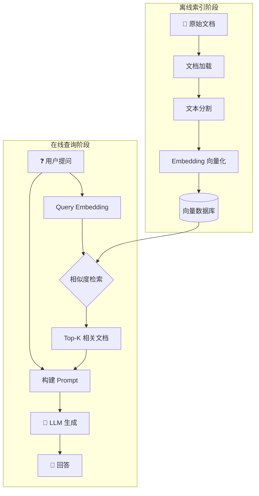

# RAG (检索增强生成)

## 1. 概念说明

**RAG (Retrieval-Augmented Generation)** 是一种将检索系统与大语言模型结合的技术架构。

### 为什么需要 RAG？

| 问题 | RAG 解决方案 |
|-----|------------|
| LLM 知识截止日期 | 从外部知识库实时检索 |
| 幻觉问题 | 基于检索内容生成，有据可查 |
| 私有数据 | 可接入企业私有知识库 |
| 上下文长度限制 | 只检索最相关的片段 |

## 2. 核心原理

### RAG 完整流程



### 关键步骤解析

1. **文档索引**：将文档切分成小块，转换为向量存储
2. **查询检索**：将用户问题向量化，在向量库中找相似文档
3. **增强生成**：将检索到的文档作为上下文，让 LLM 基于此回答

## 3. 项目实践

在本项目中，RAG 核心逻辑位于 `src/rag.ts`：

```typescript
// rag.ts - askQuestionStream 函数

export const askQuestionStream = async (
  question: string,      // 用户问题
  history: ChatMessage[], // 对话历史
  provider: LLMProvider,  // LLM 提供商
  signal?: AbortSignal    // 取消信号
): Promise<RagStreamResult> => {
  
  // 步骤 1: 获取向量存储
  const llm = getLLM(provider);
  const store = await getVectorStore();

  // 步骤 2: 检索 - 将问题向量化并查找相似文档
  const embeddings = await getQueryEmbedding(question);
  const rawResults = await store.similaritySearchVectorWithScore(
    embeddings, 
    RAG_CONFIG.retrievalK  // 检索数量
  );

  // 步骤 3: 过滤低质量结果
  const filteredResults = rawResults.filter(([_doc, distance]) => 
    distance < RAG_CONFIG.similarityThreshold
  );

  // 步骤 4: 构建 Prompt
  const context = formatDocumentsAsString(relevantDocs);
  const template = `你是本地知识库助手...
    上下文: {context}
    问题: {question}
    回答:`;

  // 步骤 5: LLM 生成
  const chain = RunnableSequence.from([prompt, llm, new StringOutputParser()]);
  const stream = await chain.stream({ context, question });

  return { stream, sources };
};
```

## 4. 关键代码片段

### 相似度检索

```typescript
// 使用向量距离进行相似度搜索
const rawResults = await store.similaritySearchVectorWithScore(
  embeddings,           // 查询向量 [0.1, 0.2, ...]
  RAG_CONFIG.retrievalK // 返回 top-k 个结果
);

// rawResults 格式: [[Document, distance], ...]
// distance 越小越相似
```

### 质量过滤

```typescript
// 过滤掉距离过大的低质量结果
const filteredResults = rawResults.filter(([_doc, distance]) => {
  return distance < RAG_CONFIG.similarityThreshold; // 如 0.8
});
```

### Prompt 模板

```typescript
const template = `你是本地知识库助手。
请优先根据以下【上下文】来回答问题。
如果上下文不相关，使用你的通用知识回答。

上下文:
{context}

当前问题: {question}

回答:`;
```

## 5. 扩展知识

### RAG 优化方向

| 方向 | 说明 |
|-----|-----|
| **Reranker** | 对检索结果二次排序，提高相关性 |
| **Hybrid Search** | 结合关键词检索和向量检索 |
| **Query Expansion** | 扩展用户查询，提升召回率 |
| **Multi-hop RAG** | 多跳检索，处理复杂问题 |

### 本项目 RAG 配置

```typescript
// config.ts
export const RAG_CONFIG = {
  retrievalK: 3,              // 检索 top-3 文档
  similarityThreshold: 0.8,   // 相似度阈值
  historyLimit: 5,            // 保留最近 5 轮对话
};
```
