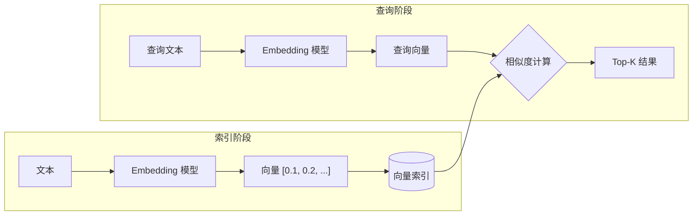

# 向量存储 (Vector Store)

## 1. 概念说明

**向量存储** 是专门用于存储和检索向量（高维数组）的数据库系统。

### 为什么需要向量存储？

传统数据库擅长精确匹配（`WHERE name = 'xxx'`），但无法处理**语义相似性**搜索。

| 搜索类型 | 传统数据库 | 向量存储 |
|---------|----------|---------|
| "苹果手机" | 只能匹配"苹果手机" | 能找到"iPhone"、"iOS设备" |
| 原理 | 关键词匹配 | 语义向量距离 |

## 2. 核心原理

### 向量存储工作流程



### 相似度计算方法

| 方法 | 公式特点 | 适用场景 |
|-----|---------|---------|
| **余弦相似度** | 计算向量夹角 | 文本语义 |
| **欧氏距离** | 计算空间距离 | 图像特征 |
| **点积** | 计算投影长度 | 归一化向量 |

## 3. 项目实践

本项目使用 **SQLite + sqlite-vss** 实现向量存储，位于 `src/sqliteStore.ts`：

```typescript
// sqliteStore.ts

class SQLiteVectorStore extends VectorStore {
  private db: Database.Database;
  private vectorDimension: number = 384; // 向量维度

  constructor(embeddings: Embeddings, dbPath: string) {
    super(embeddings, {});
    
    // 打开 SQLite 数据库
    this.db = new Database(dbPath);
    
    // 加载 sqlite-vss 向量搜索扩展
    this.db.loadExtension('vss0');
    this.db.loadExtension('vector0');
  }
}
```

### 数据库表结构

```sql
-- 文档表
CREATE TABLE IF NOT EXISTS documents (
  id INTEGER PRIMARY KEY AUTOINCREMENT,
  content TEXT NOT NULL,
  metadata TEXT,
  source TEXT
);

-- 向量虚拟表 (sqlite-vss)
CREATE VIRTUAL TABLE IF NOT EXISTS vss_documents USING vss0(
  embedding(384)  -- 384维向量
);
```

## 4. 关键代码片段

### 添加文档

```typescript
async addVectors(vectors: number[][], documents: Document[]): Promise<void> {
  const insertDoc = this.db.prepare(`
    INSERT INTO documents (content, metadata, source) 
    VALUES (?, ?, ?)
  `);
  
  const insertVec = this.db.prepare(`
    INSERT INTO vss_documents (rowid, embedding) 
    VALUES (?, ?)
  `);

  for (let i = 0; i < documents.length; i++) {
    // 1. 插入文档
    const result = insertDoc.run(
      documents[i].pageContent,
      JSON.stringify(documents[i].metadata),
      documents[i].metadata.source
    );
    
    // 2. 插入向量
    const vectorJson = JSON.stringify(vectors[i]);
    insertVec.run(result.lastInsertRowid, vectorJson);
  }
}
```

### 相似度搜索

```typescript
async similaritySearchVectorWithScore(
  query: number[], 
  k: number
): Promise<[Document, number][]> {
  
  // 使用 vss_search 进行向量搜索
  const sql = `
    SELECT 
      d.id, d.content, d.metadata,
      vss_search(v.embedding, ?) as distance
    FROM vss_documents v
    JOIN documents d ON d.id = v.rowid
    ORDER BY distance ASC
    LIMIT ?
  `;
  
  const rows = this.db.prepare(sql).all(
    JSON.stringify(query), // 查询向量
    k                      // 返回数量
  );
  
  return rows.map(row => [
    new Document({ pageContent: row.content, metadata: JSON.parse(row.metadata) }),
    row.distance  // 距离越小越相似
  ]);
}
```

### 按来源删除

```typescript
async deleteDocumentsBySource(sourcePath: string): Promise<void> {
  // 1. 获取要删除的文档 ID
  const docs = this.db.prepare(
    'SELECT id FROM documents WHERE source = ?'
  ).all(sourcePath);
  
  // 2. 删除向量
  const deleteVec = this.db.prepare(
    'DELETE FROM vss_documents WHERE rowid = ?'
  );
  docs.forEach(doc => deleteVec.run(doc.id));
  
  // 3. 删除文档
  this.db.prepare('DELETE FROM documents WHERE source = ?').run(sourcePath);
}
```

## 5. 扩展知识

### 常见向量数据库对比

| 数据库 | 特点 | 适用场景 |
|-------|-----|---------|
| **Pinecone** | 云托管，易用 | 快速上线 |
| **Milvus** | 开源，高性能 | 大规模生产 |
| **Chroma** | 轻量，Python友好 | 开发测试 |
| **sqlite-vss** | 嵌入式，无依赖 | 本地应用 |

### 本项目选择 sqlite-vss 的原因

1. **无需外部服务** - 适合桌面应用
2. **数据本地化** - 保护隐私
3. **轻量部署** - 单文件数据库
