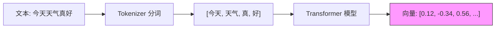
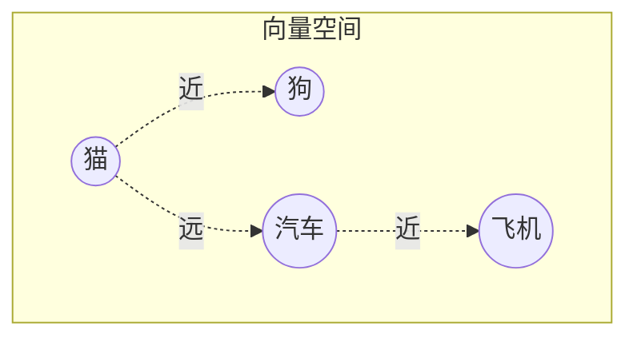

# Embeddings (文本嵌入)

## 1. 概念说明

**Embedding** 是将文本转换为**数值向量**的过程，使计算机能够理解语义。

### 核心思想

> "意思相近的词，在向量空间中距离也相近"

```
"国王" - "男人" + "女人" ≈ "女王"
```

## 2. 核心原理

### Embedding 生成流程



### 向量表示语义



## 3. 项目实践

本项目使用 **HuggingFace Transformers** 本地模型，位于 `src/model.ts`：

```typescript
// model.ts

import { HuggingFaceTransformersEmbeddings } from 
  '@langchain/community/embeddings/huggingface_transformers';

let embeddingInstance: Embeddings | null = null;

export const getEmbeddings = async (): Promise<Embeddings> => {
  if (!embeddingInstance) {
    console.log('正在初始化本地 Embeddings...');
    
    // 动态导入 ESM 模块
    const { env } = await import('@huggingface/transformers');

    // 配置 HuggingFace 镜像 (国内加速)
    env.allowLocalModels = true;
    env.useBrowserCache = false;
    env.remoteHost = 'https://hf-mirror.com';

    // 实例化 Embeddings
    embeddingInstance = new HuggingFaceTransformersEmbeddings({
      model: 'Xenova/all-MiniLM-L6-v2',  // 384 维向量
    });
  }
  return embeddingInstance;
};
```

### 配置说明

```typescript
// config.ts
export const EMBEDDING_CONFIG = {
  model: 'Xenova/all-MiniLM-L6-v2',    // 模型名称
  allowLocalModels: true,              // 允许本地缓存
  remoteHost: 'https://hf-mirror.com', // 国内镜像
};
```

## 4. 关键代码片段

### 获取单个文本的 Embedding

```typescript
const embedding = await embeddings.embedQuery("今天天气真好");
// 结果: [0.12, -0.34, 0.56, ...] (384维数组)
```

### 批量 Embedding

```typescript
const texts = ["苹果", "香蕉", "橙子"];
const vectors = await embeddings.embedDocuments(texts);
// 结果: [[...], [...], [...]] (3个384维数组)
```

### Embedding 缓存优化

```typescript
// rag.ts - 缓存查询 Embedding
const CACHE_SIZE = 50;
const embeddingCache = new Map<string, number[]>();

const getQueryEmbedding = async (query: string): Promise<number[]> => {
  // 检查缓存
  if (embeddingCache.has(query)) {
    console.log('[RAG] 使用缓存的 embedding');
    return embeddingCache.get(query)!;
  }

  // 计算新的 embedding
  const store = await getVectorStore();
  const embedding = await store.embeddings.embedQuery(query);

  // 添加到缓存 (LRU 风格)
  if (embeddingCache.size >= CACHE_SIZE) {
    const firstKey = embeddingCache.keys().next().value;
    embeddingCache.delete(firstKey);
  }
  embeddingCache.set(query, embedding);

  return embedding;
}
```

## 5. 扩展知识

### 常见 Embedding 模型对比

| 模型 | 维度 | 大小 | 特点 |
|-----|-----|-----|-----|
| **all-MiniLM-L6-v2** | 384 | 22MB | 轻量，速度快 |
| **bge-large-zh** | 1024 | 1.3GB | 中文优化 |
| **text-embedding-ada-002** | 1536 | API | OpenAI 高质量 |
| **mxbai-embed-large** | 1024 | 1.3GB | 多语言 |

### 本项目选择 MiniLM 的原因

1. **轻量** - 只有 22MB，适合桌面应用
2. **本地运行** - 无需 API 调用
3. **效果不错** - 在多项基准测试中表现优秀
