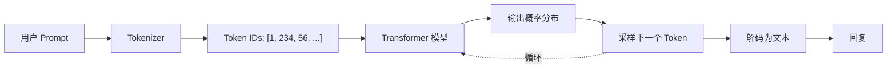
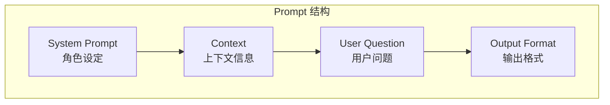

# LLM (大语言模型)

## 1. 概念说明

**LLM (Large Language Model)** 是基于 Transformer 架构训练的超大规模神经网络，能够理解和生成自然语言。

### 关键特性

| 特性 | 说明 |
|-----|-----|
| **生成式** | 基于概率预测下一个 token |
| **上下文学习** | 无需微调，通过 prompt 引导 |
| **涌现能力** | 规模增大产生新能力 |

## 2. 核心原理

### LLM 调用流程



### Prompt 工程



## 3. 项目实践

本项目支持 **DeepSeek** 和 **Gemini** 两个 LLM，位于 `src/model.ts`：

```typescript
// model.ts

import { ChatOpenAI } from '@langchain/openai';
import { ChatGoogleGenerativeAI } from '@langchain/google-genai';

export const getLLM = (provider: LLMProvider): BaseChatModel => {
  switch (provider) {
    case LLMProvider.DEEPSEEK:
      console.log('使用 DeepSeek (通过 OpenAI 兼容接口)');
      return new ChatOpenAI({
        apiKey: getEnv('DEEPSEEK_API_KEY'),
        configuration: {
          baseURL: 'https://api.deepseek.com/v1',
        },
        modelName: 'deepseek-chat',
        temperature: 0.7,
      });

    case LLMProvider.GEMINI:
      console.log('使用 Google Gemini');
      return new ChatGoogleGenerativeAI({
        apiKey: getEnv('GOOGLE_API_KEY'),
        model: 'gemini-1.5-flash',
        maxOutputTokens: 2048,
      });

    default:
      throw new Error(`不支持的提供商: ${provider}`);
  }
};
```

### 配置说明

```typescript
// config.ts
export const LLM_CONFIG = {
  deepseek: {
    baseURL: 'https://api.deepseek.com/v1',
    model: 'deepseek-chat',
    temperature: 0.7,
  },
  gemini: {
    model: 'gemini-1.5-flash',
    maxOutputTokens: 2048,
  },
};
```

## 4. 关键代码片段

### LangChain 链式调用

```typescript
// 构建 Prompt -> LLM -> 输出解析 的链
const chain = RunnableSequence.from([
  PromptTemplate.fromTemplate(template),  // Prompt 模板
  llm,                                     // LLM 模型
  new StringOutputParser(),                // 输出解析器
]);

// 调用链
const response = await chain.invoke({
  context: "相关文档内容...",
  question: "用户问题"
});
```

### 流式输出

```typescript
// 流式生成 (逐字返回)
const stream = await chain.stream({
  context: "...",
  question: "..."
});

for await (const chunk of stream) {
  console.log(chunk);  // 逐字打印
}
```

### Temperature 参数

```typescript
// temperature 控制输出随机性
new ChatOpenAI({
  temperature: 0,    // 确定性输出
  // temperature: 0.7, // 平衡创意
  // temperature: 1,   // 高度随机
});
```

## 5. 扩展知识

### 常见 LLM 对比

| 模型 | 提供商 | 特点 |
|-----|-------|-----|
| **GPT-4** | OpenAI | 综合能力最强 |
| **Claude 3** | Anthropic | 长上下文、安全 |
| **DeepSeek** | 深度求索 | 性价比高、中文友好 |
| **Gemini** | Google | 多模态、开放 |
| **LLaMA 3** | Meta | 开源、可本地部署 |

### 本项目双 LLM 的原因

1. **DeepSeek** - 价格便宜，中文效果好
2. **Gemini** - 备用方案，Google 生态
