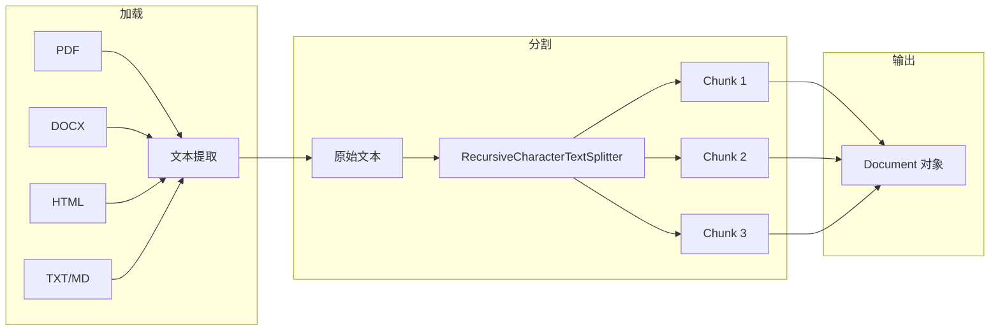

# 文档加载与分割

## 1. 概念说明

**文档加载与分割** 是 RAG 系统的数据预处理阶段，将各种格式的文档转换为适合向量化的文本块。

### 为什么需要分割？

| 问题 | 分割解决方案 |
|-----|------------|
| 文档太长 | 切成小块，分别向量化 |
| LLM 上下文限制 | 只检索最相关的块 |
| 检索精度 | 小块更精准定位信息 |

## 2. 核心原理

### 文档处理流程



### 分割策略对比


## 3. 项目实践

本项目文档加载逻辑位于 `src/loader.ts`：

```typescript
// loader.ts

import { Document } from '@langchain/core/documents';
import { RecursiveCharacterTextSplitter } from '@langchain/textsplitters';
import * as cheerio from 'cheerio';
const pdf = require('pdf-parse');
const mammoth = require('mammoth');

export const loadAndSplit = async (filePath: string): Promise<Document[]> => {
  console.log(`正在加载文件: ${filePath}`);

  let text = '';
  const ext = path.extname(filePath).toLowerCase();

  // 根据文件类型加载
  if (ext === '.pdf') {
    const dataBuffer = fs.readFileSync(filePath);
    const data = await pdf(dataBuffer);
    text = data.text;
  } else if (ext === '.docx') {
    const dataBuffer = fs.readFileSync(filePath);
    const result = await mammoth.extractRawText({ buffer: dataBuffer });
    text = result.value;
  } else if (ext === '.html') {
    const fileContent = fs.readFileSync(filePath, 'utf-8');
    const $ = cheerio.load(fileContent);
    text = $('body').text().replace(/\s+/g, ' ').trim();
  } else {
    // 默认为文本文件
    text = fs.readFileSync(filePath, 'utf-8');
  }

  // 创建初始文档
  const docs = [new Document({ 
    pageContent: text, 
    metadata: { source: filePath } 
  })];

  // 分割文档
  const splitter = new RecursiveCharacterTextSplitter({
    chunkSize: 500,      // 每块最大 500 字符
    chunkOverlap: 100,   // 重叠 100 字符
    separators: ['\n\n', '\n', '。', '！', '？', '；', '，', ' ', ''],
  });

  const splitDocs = await splitter.splitDocuments(docs);
  console.log(`分割为 ${splitDocs.length} 个块。`);
  return splitDocs;
};
```

## 4. 关键代码片段

### 支持的文件类型

```typescript
// PDF 解析
const data = await pdf(dataBuffer);
text = data.text;

// DOCX 解析
const result = await mammoth.extractRawText({ buffer: dataBuffer });
text = result.value;

// HTML 解析
const $ = cheerio.load(fileContent);
text = $('body').text();
```

### 分割器参数

```typescript
const splitter = new RecursiveCharacterTextSplitter({
  chunkSize: 500,      // 目标块大小
  chunkOverlap: 100,   // 块之间重叠
  separators: [        // 分割优先级 (从左到右)
    '\n\n',            // 1. 优先按段落
    '\n',              // 2. 再按换行
    '。', '！', '？',   // 3. 再按中文句号
    '；', '，',        // 4. 再按中文标点
    ' ',               // 5. 再按空格
    ''                 // 6. 最后按字符
  ],
});
```

### 重叠的作用

```
原文: A B C D E F G H I J

分块 (无重叠):
  [A B C D E] [F G H I J]
  问题: "D E F" 被切断

分块 (有重叠):
  [A B C D E] [D E F G H] [G H I J]
  优势: "D E F" 完整保留
```

## 5. 扩展知识

### 分割策略选择

| 策略 | 适用场景 |
|-----|---------|
| **固定长度** | 代码、日志 |
| **递归分割** | 自然语言文档 |
| **语义分割** | 需要理解上下文 |
| **Markdown 分割** | Markdown 文档 |

### 最佳实践

1. **chunkSize** - 通常 500-1000，视模型上下文而定
2. **chunkOverlap** - 通常 10-20% 的 chunkSize
3. **separators** - 根据语言调整（中文需要特殊标点）
