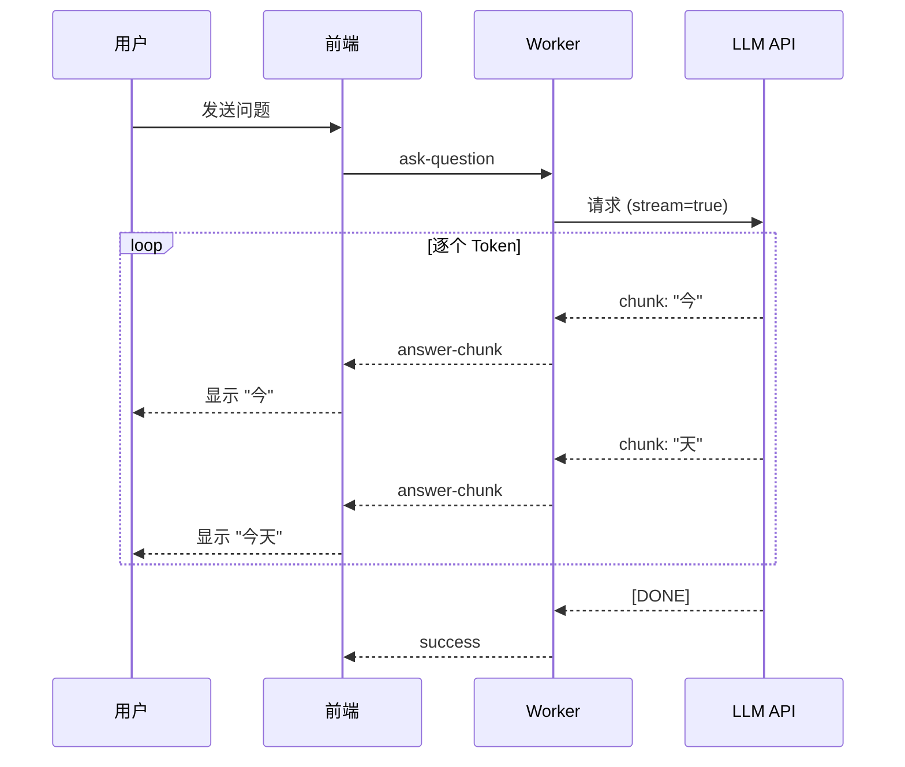
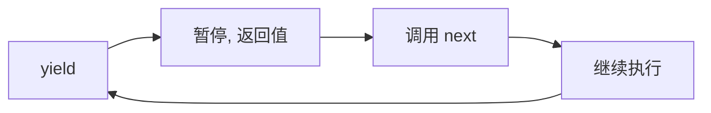

# 流式生成 (Streaming)

## 1. 概念说明

**流式生成** 是 LLM 逐字输出的技术，让用户在生成完成前就能看到部分结果。

### 为什么需要流式？

| 传统方式 | 流式方式 |
|---------|---------|
| 等待全部生成 | 逐字显示 |
| 用户等待焦虑 | 即时反馈 |
| 超时风险 | 立即响应 |

## 2. 核心原理

### 流式生成流程



### AsyncGenerator 工作原理



## 3. 项目实践

### 后端流式生成 (rag.ts)

```typescript
// rag.ts

export const askQuestionStream = async (
  question: string,
  history: ChatMessage[],
  provider: LLMProvider,
  signal?: AbortSignal
): Promise<RagStreamResult> => {
  
  // 构建 Chain
  const chain = RunnableSequence.from([
    prompt, 
    llm, 
    new StringOutputParser()
  ]);

  // 获取原始流
  const rawStream = await chain.stream(
    { context, chat_history, question },
    { signal }  // 支持取消
  );

  // 包装流，添加完成日志
  const streamWithLog = async function* (): AsyncGenerator<string> {
    try {
      for await (const chunk of rawStream) {
        yield chunk;  // 逐块产出
      }
    } finally {
      console.log('流式生成完成');
    }
  };

  return { stream: streamWithLog(), sources };
};
```

### Worker 转发流 (worker.ts)

```typescript
// worker.ts

const handleAskQuestion: MessageHandler = async (data, ctx) => {
  const { stream, sources } = await askQuestionStream(
    question, history, llmProvider, currentController.signal
  );

  // 发送开始事件
  parentPort?.postMessage({ 
    id: ctx.id, 
    type: 'answer-start', 
    sources 
  });

  // 逐块转发
  let fullAnswer = '';
  for await (const chunk of stream) {
    fullAnswer += chunk;
    parentPort?.postMessage({ 
      id: ctx.id, 
      type: 'answer-chunk', 
      chunk 
    });
  }

  return { success: true, answer: fullAnswer, sources };
};
```

### 前端接收流 (App.tsx)

```typescript
// App.tsx

const handleSend = async () => {
  // 监听流式事件
  const handleAnswerStart = (_event, data) => {
    setMessages(prev => [
      ...prev,
      { role: 'assistant', content: '', sources: data.sources }
    ]);
  };

  const onChunk = (_event, msg) => {
    setMessages(prev => {
      const updated = [...prev];
      const last = updated[updated.length - 1];
      if (last.role === 'assistant') {
        last.content += msg.chunk;  // 追加内容
      }
      return updated;
    });
  };

  // 注册监听器
  window.electronAPI.on('answer-start', handleAnswerStart);
  window.electronAPI.on('answer-chunk', onChunk);

  // 发送请求
  await window.electronAPI.askQuestion(question, history, provider);
};
```

## 4. 关键代码片段

### Generator 函数

```typescript
// function* 定义生成器函数
const simpleGenerator = function* () {
  yield 1;  // 返回 1，暂停
  yield 2;  // 返回 2，暂停
  yield 3;  // 返回 3，暂停
};

const gen = simpleGenerator();
gen.next(); // { value: 1, done: false }
gen.next(); // { value: 2, done: false }
gen.next(); // { value: 3, done: false }
gen.next(); // { value: undefined, done: true }
```

### Async Generator

```typescript
// async function* 定义异步生成器
const asyncGenerator = async function* () {
  for (let i = 0; i < 3; i++) {
    await delay(1000);
    yield i;
  }
};

// for await...of 消费
for await (const value of asyncGenerator()) {
  console.log(value);  // 0, 1, 2 (每秒一个)
}
```

### 取消流式生成

```typescript
// AbortController 实现取消
let currentController: AbortController | null = null;

const handleAskQuestion = async () => {
  // 取消之前的请求
  if (currentController) {
    currentController.abort();
  }
  currentController = new AbortController();

  try {
    const { stream } = await askQuestionStream(
      question, history, provider,
      currentController.signal  // 传入 signal
    );
    // ...
  } catch (error) {
    if (currentController.signal.aborted) {
      console.log('生成已取消');
    }
  }
};

// 停止按钮
const handleStop = () => {
  currentController?.abort();
};
```

## 5. 扩展知识

### 流式技术对比

| 技术 | 适用场景 |
|-----|---------|
| **SSE (Server-Sent Events)** | Web 服务器推送 |
| **WebSocket** | 双向实时通信 |
| **HTTP Chunked** | HTTP 分块传输 |
| **AsyncGenerator** | 进程内流式 |

### 本项目流式架构

```
LLM API
   ↓ (HTTP Stream)
Worker Thread (AsyncGenerator)
   ↓ (postMessage)
Main Process
   ↓ (IPC)
Renderer (React 状态更新)
```
