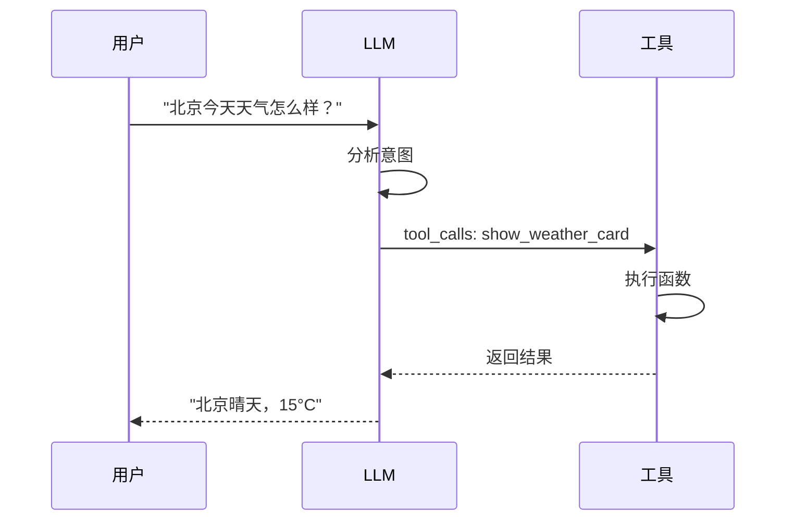
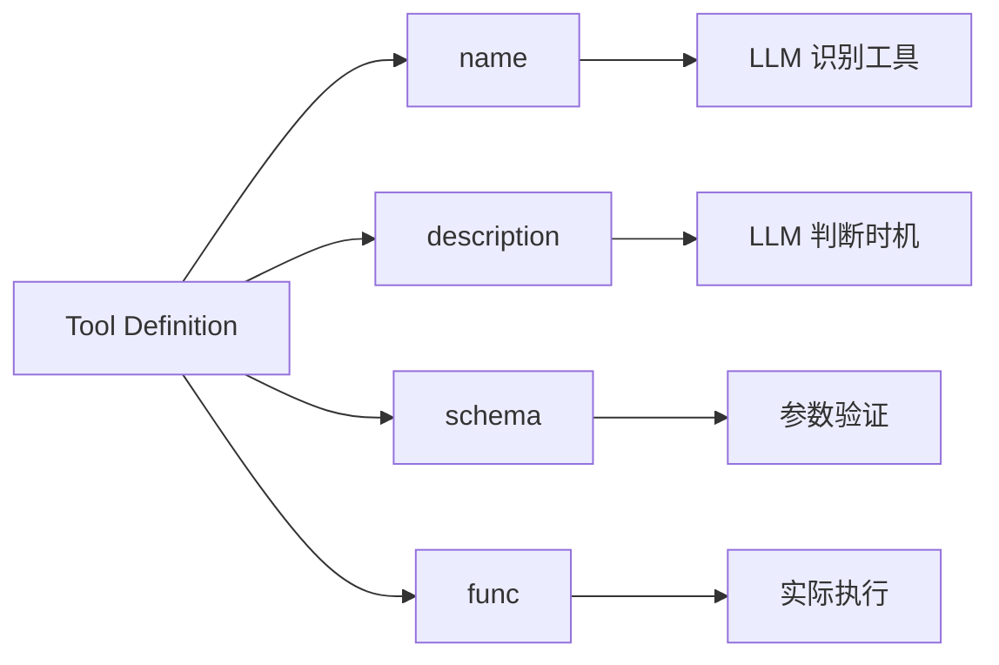

# Function Calling

## 1. 概念说明

**Function Calling** 是 LLM 的高级能力，让 AI 能够主动调用外部工具或函数来完成任务。

### 为什么需要 Function Calling？

| 传统方式 | Function Calling |
|---------|-----------------|
| "抱歉，我无法获取实时信息" | 自动调用工具获取数据 |
| 依赖 Prompt 格式 | 结构化 API 调用 |
| 正则解析容易出错 | Schema 自动验证 |

## 2. 核心原理

### Function Calling 流程



### 工具定义结构



## 3. 项目实践

### 定义工具 (rag.ts)

```typescript
// src/rag.ts

import { DynamicStructuredTool } from '@langchain/core/tools';
import { z } from 'zod';

// 1. 定义天气卡片工具
const weatherCardTool = new DynamicStructuredTool({
  name: 'show_weather_card',
  
  description: '当用户询问天气相关问题时，调用此工具显示天气卡片',
  
  // Zod schema 定义参数
  schema: z.object({
    city: z.string().describe('城市名称'),
    temp: z.number().describe('温度（摄氏度）'),
    condition: z.string().describe('天气状况：晴、多云、雨、雪'),
    icon: z.enum(['sunny', 'cloudy', 'rain', 'snow']).describe('天气图标'),
  }),
  
  // 工具执行函数
  func: async ({ city, temp, condition, icon }) => {
    console.log(`[Tool] 显示天气卡片: ${city}, ${temp}°C, ${condition}`);
    return `已显示${city}的天气卡片`;
  },
});

// 2. 绑定工具到 LLM
export const askQuestionStream = async (...) => {
  const baseLLM = getLLM(provider);
  
  // bindTools 启用 Function Calling
  const llm = baseLLM.bindTools 
    ? baseLLM.bindTools([weatherCardTool])
    : baseLLM;  // Gemini 不支持，降级
    
  // ...
};
```

### 收集 tool_calls (rag.ts)

```typescript
// src/rag.ts

const streamWithToolCalls = async function* (): AsyncGenerator<string> {
  const toolCallsCollected: ToolCall[] = [];
  
  for await (const chunk of rawStream) {
    // 检测 tool_calls
    if (chunk.additional_kwargs?.tool_calls) {
      for (const toolCall of chunk.additional_kwargs.tool_calls) {
        if (toolCall.function?.name === 'show_weather_card') {
          const args = JSON.parse(toolCall.function.arguments);
          console.log('[RAG] 检测到 tool_calls:', args);
          
          toolCallsCollected.push({
            id: toolCall.id,
            type: 'function',
            function: {
              name: toolCall.function.name,
              arguments: args,
            },
          });
        }
      }
    }
    
    // 输出文本内容
    if (chunk.content) {
      yield chunk.content;
    }
  }
  
  return { stream: streamWithToolCalls(), toolCalls: toolCallsCollected };
}
```

### Worker 转发事件 (worker.ts)

```typescript
// electron/worker.ts

const handleAskQuestion: MessageHandler = async (data, ctx) => {
  const { stream, sources, toolCalls } = await askQuestionStream(
    question, history, llmProvider
  );
  
  // 发送开始事件
  parentPort?.postMessage({ 
    id: ctx.id, 
    type: 'answer-start', 
    sources 
  });
  
  // 转发流式文本
  for await (const chunk of stream) {
    parentPort?.postMessage({ 
      id: ctx.id, 
      type: 'answer-chunk', 
      chunk 
    });
  }
  
  // 发送结构化 tool_calls 事件
  if (toolCalls.length > 0) {
    parentPort?.postMessage({
      id: ctx.id,
      type: 'tool-calls',
      toolCalls,
    });
  }
  
  return { success: true };
};
```

### 前端接收工具调用 (App.tsx)

```typescript
// app/App.tsx

const useChat = () => {
  // 监听 tool-calls 事件
  useEffect(() => {
    const handleToolCalls = (_event: any, data: { toolCalls: ToolCall[] }) => {
      console.log('[App] 收到 tool_calls:', data.toolCalls);
      
      setMessages((prev) => {
        const updated = [...prev];
        const last = updated[updated.length - 1];
        
        if (last?.role === 'assistant') {
          // 将 toolCalls 附加到消息
          last.toolCalls = data.toolCalls;
        }
        return updated;
      });
    };
    
    window.electronAPI.onToolCalls(handleToolCalls);
    
    return () => {
      window.electronAPI.removeListener('tool-calls', handleToolCalls);
    };
  }, []);
};
```

### 渲染组件 (MessageItem.tsx)

```typescript
// app/components/MessageItem.tsx

const AssistantContent = ({ content, toolCalls }) => {
  return (
    <>
      <ReactMarkdown>{content}</ReactMarkdown>
      
      {/* 渲染工具调用的组件 */}
      {toolCalls?.map((toolCall, index) => 
        renderComponent(
          toolCall.function.name,
          toolCall.function.arguments,
          `${toolCall.id}-${index}`
        )
      )}
    </>
  );
};

// ComponentParser.tsx
export const renderComponent = (type: string, props: any, key: string) => {
  switch (type) {
    case 'show_weather_card':
      return <WeatherCard key={key} {...props} />;
    default:
      return null;
  }
};
```

## 4. 关键代码片段

### Zod Schema 定义

```typescript
// 基础类型
z.string().describe('字符串参数')
z.number().describe('数字参数')
z.boolean().describe('布尔参数')

// 枚举类型
z.enum(['option1', 'option2']).describe('枚举参数')

// 可选参数
z.string().optional().describe('可选参数')

// 数组类型
z.array(z.string()).describe('字符串数组')

// 嵌套对象
z.object({
  nested: z.object({
    field: z.string()
  })
})
```

### 绑定多个工具

```typescript
const weatherTool = new DynamicStructuredTool({...});
const stockTool = new DynamicStructuredTool({...});
const newsTool = new DynamicStructuredTool({...});

// LLM 会根据问题自动选择工具
const llm = baseLLM.bindTools([
  weatherTool,
  stockTool,
  newsTool,
]);
```

### 错误处理

```typescript
// Schema 验证
const result = weatherCardTool.schema.safeParse(data);
if (!result.success) {
  console.error('参数验证失败:', result.error.errors);
  // 降级为文本输出
  return;
}

// 工具执行错误
try {
  await weatherCardTool.func(args);
} catch (error) {
  console.error('工具执行失败:', error);
  // 通知用户或降级处理
}
```

## 5. 扩展知识

### Function Calling vs Prompt

| 方式 | 实现 | 优势 | 劣势 |
|-----|-----|------|-----|
| **Prompt** | 在 Prompt 中要求格式 | 简单、兼容性好 | 不可靠、需正则 |
| **Function Calling** | 使用 bindTools API | 结构化、类型安全 | 需 LLM 支持 |

### 本项目数据流

```
LLM (tool_calls)
   ↓ (结构化 JSON)
RAG 系统 (收集)
   ↓ (postMessage)
Worker Thread
   ↓ (IPC event)
Main Process
   ↓ (tool-calls 事件)
Renderer (React 状态更新)
   ↓ (props 传递)
Component 渲染
```

### LLM 支持情况

| LLM | Function Calling | 说明 |
|-----|-----------------|------|
| **DeepSeek** | ✅ | 完全支持 (OpenAI 兼容) |
| **GPT-4** | ✅ | 原生支持 |
| **Gemini** | ⚠️ | 不支持 bindTools |
| **Claude** | ✅ | 支持 (使用 tools 参数) |
